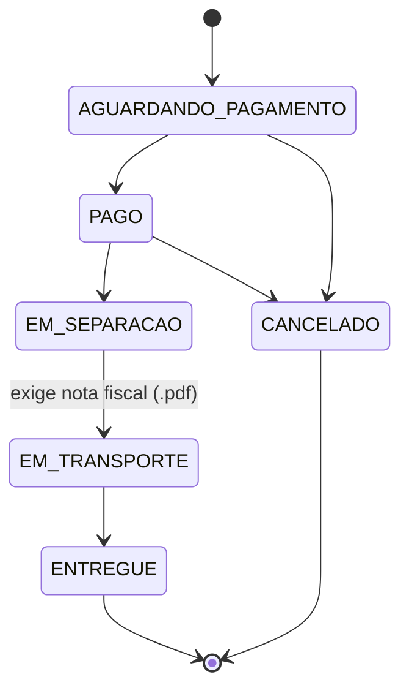
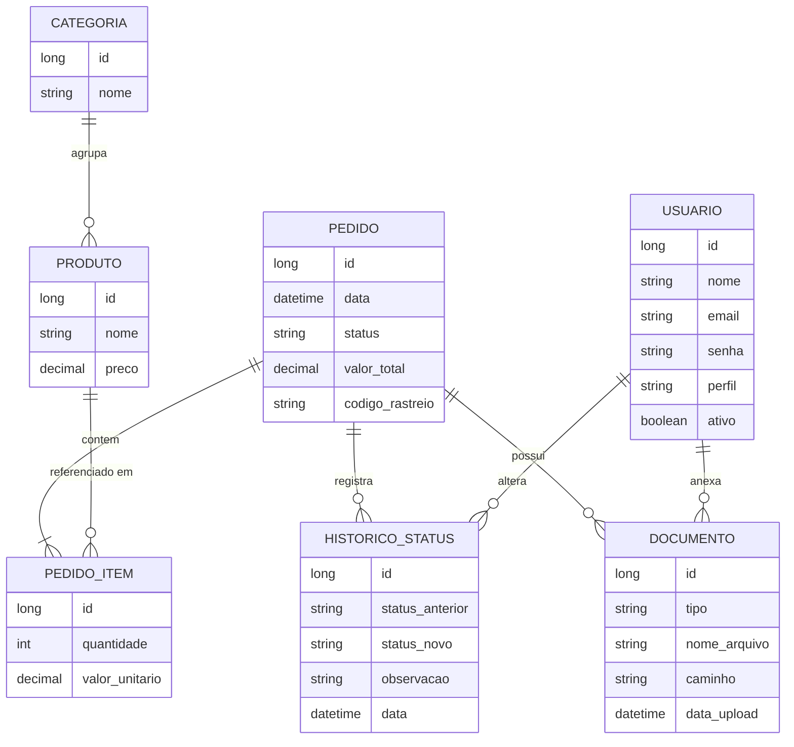

# Aulas da disciplina: Tópicos Avançados Em Programação Para Web - PW26S-6SI e PW45S-5SI

## API RESTful (*Back-end*)

A API REST será desenvolvida utilizando o *framework* **Spring** com a linguagem de programação Java.

### ⚙️ Lista de Ferramentas

-  JDK 24
- IDE:
    -  [IntelliJ Idea](https://www.jetbrains.com/idea/) ou 
    -  [Eclipse](https://eclipseide.org/)
- SDBG:
    -  Postgresql
- Ferramenta para testar a API:
    -  Postman
    -  Insomnia
-  Git
-  Docker

--- 

## Aplicação cliente (*front-end*)

O Cliente web desenvolvido utilizando a biblioteca **React** com a linguagem de programação Typescript.

### ⚙️ Lista de Ferramentas

- IDE:
    -  Visual Studio Code
    -  Web Storm, etc...
-  Node.js
-  npm
-  Git
-  Docker

## Projetos:

### aula01
- Documentação da API REST com Open API 3.0 + versionamento do Banco de Dados com Flyway.

### aula02
- Adição de permissões de usuário. Criação de uma classe para representar as permissões de usuário e associação da mesma na entidade de usuário.

### aula03
- Autenticação e autorização com validações das permissões no lado cliente.

### aula04
- **Autenticação utilizando o Google - lado cliente**. Criação da conta no Google Cloud Console e uso das credenciais na aplicação cliente para autenticação (retorno do idToken pelo Google) e na aplicação servidor para validação do idToken.

### aula05
- **Autenticação utilizando o Google - lado servidor**. Criação da conta no Google Cloud Console e uso das credenciais na aplicação servidor para autenticação (retorno do idToken pelo Google).

### aula06
- Upload de arquivos com armazenamento em **Banco de dados** e em Disco no **Sistema de arquivos**.

### aula07
- Upload de arquivos com armazenamento em um **sistema de armazenamento de objetos** utilizando **MINIO** (sistema de armazenamento de objetos **semelhante ao Amazon S3**).

### aula08
- Admininstração das aplicações com Spring Boot Admin e Registros de Log.

### aula09
- Admininstração das aplicações com Spring Boot Admin e Registros de Log (OpenTelemetry).

### aula10
- Integração da API REST com APIs de processamento de Inteligência Artificial (IA).

### aula11
- Deploy de aplicações utilizando Docker.

### aula12
- Python no navegador com PyScript + Pyodide.

# Avaliações da disciplina:

## 1 - Seminário
### Escolha uma linguagem, plataforma e/ou framework para desenvolvimento Web (Java, PHP, Node.js, Perl, Ruby on Rails, .NET(C♯, VB), Python, etc.) ou Híbrido (Web + Android e/ou IOs):

 - AUANNY COMERLATO SILVA -  Cypress
 - DOUGLAS RAMOS DE SOUSA FELIX - Nest.js
 - FABRICIO GIANNINI DE MELLO TRINDADE - Django
 - IAN CARLOS DE ANDRADE CARNEIRO - . Net C#
 - ISACK ARAUJO COSTA - Ruby on rails
 - JOSE AUGUSTO FACHIN DOS SANTOS - Flask
 - MATHEUS CARDOSO PEREIRA SANTOS - FastApi
 - MATHEUS LARA ALVES MOREIRA - Spark
 - MAYCON DA SILVA PEREZ CABO - Laravel
 - OTAVIO AUGUSTO LADORUSKI - NodeJs com Express.js
 - VICTOR HUGO CARNIEL - NodeJs com Sequelize e Fastify

#### Data da Entrega: 21/09/2026

#### Apresentações: 21/09/2026 e 22/09/2026

1. [Deverá ser entregue] Desenvolver uma apresentação (PPT, PDF ou Readme.MD no git) contendo uma breve apresentação do *framework* e/ou biblioteca escolhida:
- As vantagens e desvantagens da linguagem, *framework* e/ou plataforma. 
- Citando as principais características. 
- Servidores Web disponíveis. 
- Configurações necessárias para rodar uma aplicação. 
- Tipo de licença de software. 
- Responsáveis pelo desenvolvimento (proprietário ou comunidade). 
- Suas conclusões sobre o uso do *framework* (facilidade para encontrar materiais, qualidade deses materiais; se é de fácil configuração, etc.)

2. [Deverá ser entregue] Deverá ser criado um tutorial de configuração do *framework* e criação de uma aplicação exemplo. 
 - A aplicação exemplo deve ser UM CRUD simples (não são necessários relacionamentos) para o cadastro de Pessoa ou qualquer outro tipo de entidade entidade (Pessoa, Livro, Produto, etc.).
 - Exemplo:
`
pessoa: {nome, cpf, telefone, rua, numero, complemento, bairro, cep, cidade, estado}
`

3. O aluno deverá apresentar o trabalho e mostrar a aplicação/código-fonte da mesma (entre 15 e 30 minutos).
	
## 2 - Projeto final

### 🏪 Projeto final da disciplina - Área administrativa de uma aplicação de comércio eletrônico

No projeto final será desenvolvida a camada administrativa de um comércio eletrônico, na qual os pedidos realizados pelos clientes serão processados. Deverá ser desenvolvido o *back-end* (API REST) e o *front-end* (Cliente Web) da aplicação.

O sistema deverá contar com diferentes perfis de usuário, com permissões distintas dentro da aplicação. Deve conter uma área para o gerenciamento dos usuários, que apenas usuários com perfil ***administrador*** podem acessar e na qual atribuem permissões aos novos usuários. Um usuário deverá realizar o próprio cadastro, mas deve permanecer inativo no sistema até que um usuário com perfil ***administrador*** atribua uma permissão e ative esse usuário.

Após a autenticação, deverá ser exibida ao usuário uma tela no formato ***Painel Administrativo (dashboard)***, contendo totalizadores como o número de pedidos em cada situação e gráficos com o valor vendido mensalmente no último ano.

Deverá existir uma tela para listagem de todos os pedidos. Todo pedido realizado inicia com a situação `AGUARDANDO_PAGAMENTO` e poderá assumir outras situações ao longo do processo (ver [Ciclo de vida do pedido](#-ciclo-de-vida-do-pedido)). Os pedidos poderão estar cadastrados diretamente no banco, via *script.sql*, pois será avaliada apenas a camada de administração do *e-commerce*.

Os usuários deverão poder visualizar e editar a situação dos pedidos. Ao atualizar um pedido para `EM_TRANSPORTE`, deverá ser **anexada** uma nota fiscal ao pedido, ou seja, deverá ser possível anexar um arquivo no formato .pdf. Também poderão ser anexados comprovantes e outros documentos.
Sempre que a situação de um pedido for alterada, o cliente que efetuou o pedido deverá receber um e-mail com a atualização.

### 👥 Perfis de usuário

| Perfil | Descrição | Permissões |
|---|---|---|
| `ADMIN` | Administrador do sistema | Acesso total: gerencia usuários (ativar, desativar, atribuir perfil), pedidos, anexos e consulta a auditoria. |
| `OPERADOR` | Responsável por processar os pedidos | Visualiza o *dashboard*, lista pedidos, altera status e anexa documentos. |
| `VISUALIZADOR` | Acompanhamento/consulta | Apenas leitura: *dashboard*, pedidos e anexos. |
| *(novo usuário)* | Cadastro recém-realizado | Nenhuma — permanece **inativo** até ser ativado por um `ADMIN`. |

### 🔄 Ciclo de vida do pedido

Situações possíveis: `AGUARDANDO_PAGAMENTO`, `PAGO`, `EM_SEPARACAO`, `EM_TRANSPORTE`, `ENTREGUE` e `CANCELADO`.

As transições permitidas devem ser **validadas no *back-end*** (uma requisição com transição inválida deve retornar erro):

- `CANCELADO` e `ENTREGUE` são estados finais (não podem ser alterados).
- A passagem para `EM_TRANSPORTE` exige a nota fiscal anexada (e, opcionalmente, o código de rastreio).

### ✅ Requisitos

#### Requisitos funcionais

| Código | Requisito | Tipo |
|---|---|---|
| **RF01** | Autocadastro de usuário (permanece inativo até a ativação). | Obrigatório |
| **RF02** | Autenticação (login/logout) com controle de acesso por perfil. | Obrigatório |
| **RF03** | Gerenciamento de usuários pelo `ADMIN` (listar, ativar/desativar, atribuir perfil). | Obrigatório |
| **RF04** | *Dashboard* com totalizadores de pedidos por situação e gráfico de valor vendido por mês (últimos 12 meses). | Obrigatório |
| **RF05** | Listagem de pedidos com paginação e filtros (status, cliente, período). | Obrigatório |
| **RF06** | Detalhe do pedido (itens, cliente, valores, anexos e histórico). | Obrigatório |
| **RF07** | Alteração de status respeitando o [ciclo de vida do pedido](#-ciclo-de-vida-do-pedido). | Obrigatório |
| **RF08** | *Upload* de anexos no pedido (nota fiscal, comprovante de pagamento, outros), com visualização e *download*. | Obrigatório |
| **RF09** | Envio de e-mail ao cliente a cada alteração de status (*template* HTML simples ou texto). | Obrigatório |
| **RF10** | Histórico de alterações de status do pedido (quem alterou, quando, status anterior e novo). | Obrigatório |
| **RF11** | Registro de log das operações de atualização de pedidos e de envio de e-mails. | Obrigatório |
| **RF12** | Envio de e-mail com o documento anexado (ex.: nota fiscal). | Opcional |
| **RF13** | Notificação por e-mail ao usuário quando sua conta for ativada pelo `ADMIN`. | Opcional |
| **RF14** | Recuperação de senha por e-mail. | Opcional |
| **RF15** | Observação/comentário interno ao alterar o status e código de rastreio ao enviar para transporte. | Opcional |
| **RF16** | Exportação da listagem de pedidos (CSV ou PDF). | Opcional |
| **RF17** | Filtro de período no *dashboard*, ticket médio, produtos mais vendidos e pedidos parados há mais de X dias. | Opcional |
| **RF18** | Tela de consulta da auditoria (somente `ADMIN`). | Opcional |

#### Requisitos não funcionais

| Código | Requisito | Tipo |
|---|---|---|
| **RNF01** | Documentação da API utilizando OpenAPI 3.x (Swagger UI). | Obrigatório |
| **RNF02** | Versionamento do banco de dados com **Flyway** ou **Liquibase**. | Obrigatório |
| **RNF03** | Validação dos dados de entrada (Bean Validation) e tratamento global de erros (`@ControllerAdvice`). | Obrigatório |
| **RNF04** | Validação dos anexos: tipo (MIME) e tamanho máximo do arquivo. | Obrigatório |
| **RNF05** | Paginação e ordenação realizadas no servidor. | Obrigatório |
| **RNF06** | *Refresh token* e bloqueio de conta após várias tentativas de login sem sucesso. | Opcional |
| **RNF07** | *Download* de anexos via URL temporária (*presigned URL* no MinIO/S3). | Opcional |
| **RNF08** | Auditoria das entidades com Hibernate Envers ou tabela própria. | Opcional |
| **RNF09** | Testes unitários e de integração (JUnit + Testcontainers). | Opcional |

### 📋 Sugestões de organização do sistema

-   💻 ***Front-end***: React + TypeScript.
    -   Tela de cadastro de usuário.
    -   Tela de autenticação.
    -   Tela de Painel Administrativo.
    -   Tela de gerenciamento de usuários.
    -   Tela de listagem de pedidos.
    -   Tela de detalhe do pedido (alterar status, anexar documentos, visualizar anexos e histórico).

-   📂 ***Back-end (API)***: Spring Boot.
    -   Endpoints para gerenciamento de usuários e pedidos.
    -   Endpoint de *upload* (salvar arquivos no MinIO, localmente ou em *storage* tipo AWS S3).
    -   Serviço de envio de e-mail (ex.: Spring Mail). Em desenvolvimento, utilizar um servidor SMTP de testes como **Mailpit** ou **MailHog**.
    -   Log técnico com SLF4J/Logback e trilha de auditoria separada.

-   💾 ***Banco de dados***: PostgreSQL, MySQL ou MongoDB.

#### Modelo de dados mínimo esperado

- *** Os clientes podem estar armazenados na mesma tabela de usuários (com perfil diferente) ou em uma tabela própria de clientes.
- Produtos e categorias são tabelas secundárias e podem ser populadas diretamente via *script.sql*.

### ➡️ Alguns fluxos básicos

1.  Usuário se cadastra → fica inativo → `ADMIN` atribui um perfil e ativa a conta.
2.  Usuário autentica → vê o painel administrativo.
3.  Usuário navega para o menu Pedidos → vê a lista de pedidos (com filtros e paginação).
4.  Usuário abre um pedido → altera o status → *back-end* valida a transição → salva e registra o histórico/log → dispara e-mail para o cliente.
5.  Usuário anexa um documento → *back-end* valida e salva o arquivo → associa ao pedido → opcionalmente envia notificação.

### 📦 Artefatos de entrega

- Repositório Git com histórico de *commits* ao longo do desenvolvimento.
- `README.md` com instruções para executar o projeto (*back-end* e *front-end*).
- `docker-compose.yml` com os serviços de apoio (banco de dados, MinIO, Mailpit/MailHog).
- *Scripts* de migração do banco (Flyway/Liquibase) com dados de exemplo (usuários, clientes, produtos e pedidos).
- Documentação da API acessível via Swagger UI.

### 🧮 Critérios de avaliação

| Critério | Peso |
|---|---|
| Funcionalidades obrigatórias (RF01–RF11) | 40% |
| Requisitos não funcionais obrigatórios (RNF01–RNF05) | 20% |
| Qualidade e organização do código (camadas, boas práticas, versionamento) | 15% |
| Apresentação e domínio do código | 15% |
| Requisitos opcionais implementados | 10% |

### 📆 Prazo de entrega:

#### 📌 Entrega com apresentação: **30/11/2026** (Peso 0.70)
