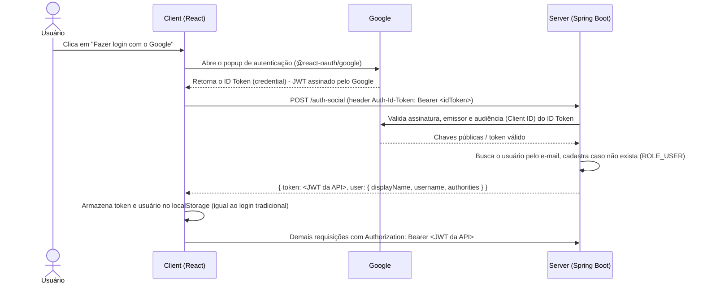

# Autenticação com Redes Sociais (Google) - Spring Security + React

Os conteúdos das aplicações cliente e servidor estão nas respectivas pastas, descritos no arquivo README.md de cada uma:

- [server/README.md](./server/README.md): alterações na API (Spring Boot) para validar o *token* emitido pelo Google e gerar o *token* JWT da própria aplicação.
- [client/README.md](./client/README.md): alterações na aplicação React para exibir o botão "Fazer login com o Google" e enviar o *token* recebido do Google para a API.

Os dois projetos partem do código da pasta **aula03** (API com Spring Boot 4, Java 25, Spring Security, JWT e MapStruct; cliente React com autenticação com usuário e senha e controle de permissões por *role*). Nesta aula foi adicionada a possibilidade de o usuário se autenticar utilizando a sua **conta Google**. A autenticação tradicional (usuário e senha) continua funcionando normalmente, a autenticação social é apenas uma **nova forma de obter o mesmo *token* JWT** que a aplicação já utilizava.

## 🧭 Visão geral do fluxo

A estratégia utilizada é a de **validação do ID Token no back-end**: quem autentica o usuário é o Google, a API apenas confere se o *token* recebido é legítimo e, a partir dele, cadastra (se necessário) o usuário e gera um JWT próprio.

Perceba que, após o passo `POST /auth-social`, o restante da aplicação não sabe (nem precisa saber) se o usuário entrou com usuário/senha ou com o Google: o *token* JWT e o objeto `user` retornados têm exatamente o mesmo formato do *login* tradicional.

## ☁️ Pré-requisito: criando as credenciais no Google Cloud

Antes de alterar o código é necessário registrar a aplicação no Google e obter um **Client ID OAuth 2.0**:

1. Acesse o [Google Cloud Console](https://console.cloud.google.com/) e crie (ou selecione) um projeto.
2. Em **APIs e serviços > Tela de permissão OAuth** (*OAuth consent screen*), configure a tela de consentimento (tipo **Externo**, nome da aplicação, e-mail de suporte). Enquanto a aplicação estiver em modo de teste, adicione os e-mails que poderão se autenticar em **Usuários de teste**.
3. Em **APIs e serviços > Credenciais**, clique em **Criar credenciais > ID do cliente OAuth**:
   - Tipo de aplicativo: **Aplicativo da Web**.
   - **Origens JavaScript autorizadas**: `http://localhost:5173` e `http://localhost` (endereços em que o front-end é executado; o Vite utiliza a porta 5173 por padrão).
   - Não é necessário informar URIs de redirecionamento, pois o fluxo utilizado é o de *popup* com ID Token.
4. Copie o **ID do cliente** gerado (algo como `xxxxxxxx.apps.googleusercontent.com`).

O **mesmo Client ID** deve ser configurado nos dois projetos:

| Projeto | Arquivo | Uso |
| --- | --- | --- |
| server | `src/main/resources/application.yml` (propriedade `google.client-id`, ou variável de ambiente `GOOGLE_CLIENT_ID`) | Verificar se o ID Token foi emitido para a nossa aplicação (*audience*). |
| client | `.env` (variável `VITE_GOOGLE_CLIENT_ID`, lida em `src/main.tsx`) | Inicializar a biblioteca de autenticação do Google no navegador. |

> ⚠️ O *Client ID* não é um segredo (ele fica visível no código JavaScript do navegador), mas **nunca** versione o *Client Secret*. Neste fluxo o *Client Secret* não é utilizado.

## ▶️ Executando

1. Inicie a API: na pasta `server`, execute `./mvnw spring-boot:run` (porta `8080`, requer Java 25).
2. Inicie o cliente: na pasta `client`, copie o arquivo `.env.example` para `.env`, execute `npm install` e depois `npm run dev` (porta `5173`).
3. Acesse `http://localhost:5173/login` e clique em **Fazer login com o Google**.
