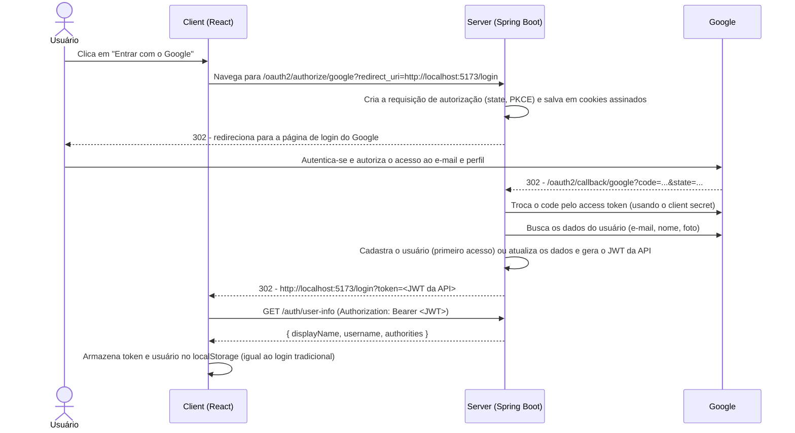

# Autenticação com Redes Sociais (Google) no Servidor - Spring Security OAuth2 Client + React

Os conteúdos das aplicações cliente e servidor estão nas respectivas pastas, descritos no arquivo README.md de cada uma:

- [server/README.md](./server/README.md): configuração do **Spring Security OAuth2 Client** para que a própria API realize a autenticação com o Google, cadastre o usuário e gere o *token* JWT.
- [client/README.md](./client/README.md): alterações na aplicação React para redirecionar o usuário para a API e receber o *token* JWT ao final da autenticação.

Na **aula04** a autenticação com o Google acontecia no **front-end**: a biblioteca `@react-oauth/google` abria o *popup* do Google, recebia o **ID Token** e o enviava para a API validar (`POST /auth-social`). Nesta aula a responsabilidade muda de lugar: **toda a autenticação com o Google ocorre na aplicação server**, utilizando o fluxo **Authorization Code** do OAuth 2.0, implementado pelo Spring Security. O front-end não conhece nenhuma credencial do Google e não possui nenhuma biblioteca do Google: ele apenas redireciona o usuário para a API e, ao final, recebe o *token* JWT da aplicação.

Os dois projetos partem do código da **aula04** (API com Spring Boot 4, Java 25, Spring Security, JWT e MapStruct; cliente React com autenticação com usuário e senha e controle de permissões por *role*).

## 🧭 Visão geral do fluxo



## ⚖️ Comparando com a aula04

| | aula04 - autenticação no cliente | aula05 - autenticação no servidor |
| --- | --- | --- |
| Quem conversa com o Google | O navegador (biblioteca `@react-oauth/google`) | A API (Spring Security OAuth2 Client) |
| Fluxo OAuth 2.0 / OpenID Connect | ID Token (*Sign In With Google*) | *Authorization Code* com PKCE |
| O que o front-end recebe do Google | ID Token (JWT do Google) | Nada: recebe apenas o JWT da API |
| Credenciais necessárias | Client ID (cliente e servidor) | Client ID **e Client Secret** (somente no servidor) |
| Configuração no Google Cloud | Origens JavaScript autorizadas | URIs de redirecionamento autorizados |
| *Endpoints* da API | `POST /auth-social` | `/oauth2/authorize/google` e `/oauth2/callback/google` |
| Como o JWT chega ao front-end | Resposta JSON do `POST /auth-social` | Parâmetro `token` na URL de retorno |

Vantagens de realizar a autenticação no servidor: o *client secret* e o *access token* do Google nunca chegam ao navegador; adicionar outro provedor (GitHub, Facebook, ...) exige apenas configuração e uma classe na API, sem alterar o front-end; e a mesma API pode atender outros clientes (aplicativos *mobile*, por exemplo) com o mesmo fluxo.

## ☁️ Pré-requisito: credenciais no Google Cloud

1. Acesse o [Google Cloud Console](https://console.cloud.google.com/) e crie (ou selecione) um projeto.
2. Em **APIs e serviços > Tela de permissão OAuth**, configure a tela de consentimento (tipo **Externo**). Enquanto a aplicação estiver em modo de teste, adicione os e-mails que poderão se autenticar em **Usuários de teste**.
3. Em **APIs e serviços > Credenciais**, clique em **Criar credenciais > ID do cliente OAuth**:
   - Tipo de aplicativo: **Aplicativo da Web**.
   - **URIs de redirecionamento autorizados**: `http://localhost:8080/oauth2/callback/google` (endereço da **API** para o qual o Google devolve o usuário após a autenticação).
4. Copie o **ID do cliente** e a **Chave secreta do cliente** (*client secret*).

As credenciais são configuradas **somente no server**, no arquivo **`server/.env`**. Esse arquivo é ignorado pelo Git, por isso o projeto possui o modelo **`server/.env.example`**, que deve ser copiado para `.env`:

```bash
cd server
cp .env.example .env
```

```properties
# server/.env
GOOGLE_CLIENT_ID=<id-do-cliente>.apps.googleusercontent.com
GOOGLE_CLIENT_SECRET=<chave-secreta-do-cliente>
OAUTH2_COOKIE_SECRET=<texto-aleatorio-e-longo>
```

| Variável | Conteúdo |
| --- | --- |
| `GOOGLE_CLIENT_ID` | ID do cliente (opcional, o `application.yml` possui um valor padrão). |
| `GOOGLE_CLIENT_SECRET` | Chave secreta do cliente (**obrigatória**). |
| `OAUTH2_COOKIE_SECRET` | Chave que assina o *cookie* do fluxo OAuth2 (opcional, o `application.yml` possui um valor padrão para desenvolvimento). Um valor pode ser gerado com `openssl rand -base64 32`. |

Os mesmos valores também podem ser informados como variáveis de ambiente do sistema operacional (ou da IDE), que têm prioridade sobre o `.env`.

> ⚠️ O *client secret* é um **segredo**: nunca o coloque no código-fonte, no `application.yml`, no `.env.example` ou em um repositório Git. Se ele for exposto, gere uma nova chave no Google Cloud Console.

## ▶️ Executando

1. Inicie a API: na pasta `server`, crie o arquivo `.env` (ver acima) e execute `./mvnw spring-boot:run` (porta `8080`, requer Java 25). Na IDE, a *working directory* da configuração de execução deve ser a pasta `server`, onde está o `.env`.
2. Inicie o cliente: na pasta `client`, execute `npm install` e depois `npm run dev` (porta `5173`).
3. Acesse `http://localhost:5173/login` e clique em **Entrar com o Google**.
